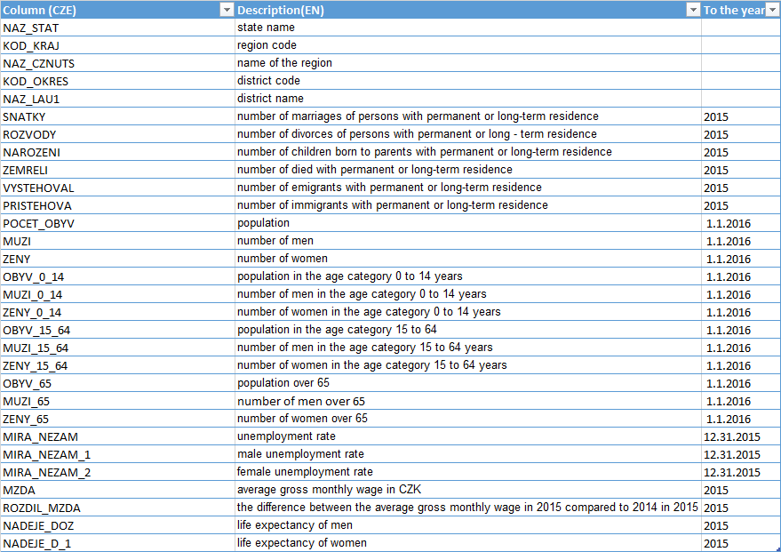

```{r setup, include=FALSE}
knitr::opts_chunk$set(echo = TRUE)
```

## R Markdown

In this project I would like to deal with spatial and statistical data analysis of the Digital vector geographic database of the Czech Republic **ArcCR500** created in scale details 1:500 000 (km). The data was created in cooperation with ARCDATA PRAHA, the Czech Survey Office and the Czech Statistical Office and is distributed free of charge.

The spatial dataset ArcCR500 consists of two file geodatabases that contain geographical and some statistical information about the Czech Republic. The first geodatabase contains especially the topographic data. The second geodatabase which is of interest to this project contains Vector polygon layers of administrative breakdown from the level "state" to the level "village". For the levels "state", "region" and "district" the statistical data provided by the Czech Statistical Office
are attached. These include not only the number of inhabitants in individual territorial units but also information of numbers of men/women, births, deaths, divorces, marriages, evictions, immigrants and unemployment rates and so forth.

Before analysis in RStudio, data from the ESRI geodatabase in the form of feature was converted to three shapefiles - for the state, for regions, and for districts. These shapefiles can then be loaded to RStudio and analyzed separately. 

The aim of this project is to perform both Exploratory Data Analysis (EDA) of selected statistical
indicators and the plot of these indicators in the form of maps. After exploring this data Choropleth maps and Cartograms of selected statistical indicators will be created using different mapping packages in RStudio as sf, ggspatial, tidyverse, tmap.

##  Statistical data analysis of ArcCR500 {.tabset .tabset-fade .tabset-pills}

### Introduction to data and setting up

First, we need to load several packages that are very useful while working with geodata.

```{r Setting up}

library("pacman") #this package allows us to use the `pload()` function below to load multiple packages in one line
p_load(rgdal, sf, tidyverse, tmap, spData, spatstat, maptools, ggrepel, ggspatial, rworldmap, rworldxtra)

```

Secondly, I would like to introduce our data. It comes from the ESRI geodatabase and it was converted to three shapefiles - state, regions, and districts. All these shapefiles have specific statistical information attached. However, these the columns are in the Czech language, therefore, I would like to describe deeply what those particular columns mean.

Statistical data are assigned to individual levels that include the latest possible data (mostly from 2015), including the latest results of the 2011 Census of Housing and Dwellings.

```{r states}

# Read in state data
state <- st_read("state.shp")
head(state)
st_crs(state)
dim(state)

```

```{r regions}

# Read in regions data
regions <- st_read("regions.shp")
head(regions)
st_crs(regions)
dim(regions)

```

```{r districts}

# Read in districts data
districts <- st_read("districts.shp")
head(districts)
st_crs(districts)
dim(districts)

```

As we can notice, all shapefiles have the same CRS called Krovak which is used in the Czech Republic.
The state shapefile consists of only one row that includes overall statistics for the whole Czech republic. We will not use that shapefile much, it is rather for interest. The Czech Republic consists of 14 regions and 77 districts. For further analyzes it is necessary to describe in detail the individual statistical indicators that these region and district data package contains.

The description of statistical indicators and other columns:



We can have a look at data now and plot Population indicator for state, regions and districts.

```{r fig.width=12, fig.height=8}

bb<-st_bbox(state)

 
ggplot(state) +
  geom_sf( aes(fill=POCET_OBYV), alpha=0.7, col="black") +
  theme(legend.position="bottom") +
  labs(fill= "The population in the Czech republic in 2015", size=NULL) +
  coord_sf(xlim=c(bb[1],bb[3]), ylim=c(bb[2], bb[4]), expand=FALSE) +
  geom_sf_text(aes(label=NAZ_STAT), size=2, fontface="bold") +
  annotation_scale(location = "tr", style="bar", width_hint = 0.2, 
                   pad_y = unit(0.25, "in"), pad_x =unit(1.1, "in")) +
  annotation_north_arrow(location = "tr", which_north = "true", 
                         pad_x = unit(0.75, "in"), pad_y = unit(0.25, "in"), 
                         height= unit(0.25, "in"), width = unit(0.15, "in")) 

```

```{r fig.width=12, fig.height=8}

ggplot(regions) +
  geom_sf( aes(fill=POCET_OBYV), alpha=0.7, col="black") +
  theme(legend.position="bottom") +
  theme(legend.key.width=unit(2,"cm"))+
  labs(fill= "The population in regions in the Czech republic in 2015", size=NULL) +
  coord_sf(xlim=c(bb[1],bb[3]), ylim=c(bb[2], bb[4]), expand=FALSE) +
  geom_sf_text(aes(label=NAZ_CZNUTS), size=2, fontface="bold") +
  annotation_scale(location = "tr", style="bar", width_hint = 0.2, 
                   pad_y = unit(0.25, "in"), pad_x =unit(1.1, "in")) +
  annotation_north_arrow(location = "tr", which_north = "true", 
                         pad_x = unit(0.75, "in"), pad_y = unit(0.25, "in"), 
                         height= unit(0.25, "in"), width = unit(0.15, "in")) 

```

```{r fig.width=12, fig.height=8}

ggplot(districts) +
  geom_sf( aes(fill=POCET_OBYV), alpha=0.7, col="black") +
  theme(legend.position="bottom") +
  theme(legend.key.width=unit(2,"cm"))+
  scale_fill_gradientn(colours = c("blue", "lightblue", "lightgreen", "green", "red"),
                           breaks=c(30000,50000,75000,100000,Inf),
                           guide = "colorbar")+
  labs(fill= "The population in districts in the Czech republic in 2015", size=NULL) +
  coord_sf(xlim=c(bb[1],bb[3]), ylim=c(bb[2], bb[4]), expand=FALSE) +
  geom_sf_text(aes(label=NAZ_LAU1), size=2, fontface="bold") +
  annotation_scale(location = "tr", style="bar", width_hint = 0.2, 
                   pad_y = unit(0.25, "in"), pad_x =unit(1.1, "in")) +
  annotation_north_arrow(location = "tr", which_north = "true", 
                         pad_x = unit(0.75, "in"), pad_y = unit(0.25, "in"), 
                         height= unit(0.25, "in"), width = unit(0.15, "in")) 

```

### EDA: Overall descriptive statistics and histograms

```{r descriptive statistics }

# Convert sp object to dataframe
districts_frame <- as.data.frame(districts)
summary(districts_frame)

# Mean 
sapply(districts_frame [ ,8:14], mean)
sapply(districts_frame [ ,15:25], mean)
sapply(districts_frame [ ,26:30], mean)

# Standard deviation
sapply(districts_frame [ ,8:14], sd)
sapply(districts_frame [ ,15:25], sd)
sapply(districts_frame [ ,26:30], sd)

# Range
sapply(districts_frame [ ,8:14], range)
sapply(districts_frame [ ,15:25], range)
sapply(districts_frame [ ,26:30], range)

```

Now we can have a look at some data frequencies.

```{r package data frequency, out.width ='\\maxwidth'}

# We can see the most frequent values of population in districts in the CR
hist(districts_frame$POCET_OBYV, breaks = 15, col="lightblue", main = "Histogram of population in districts in the Czech Republic", xlab = "Population")

# We can see the most frequent values of weddings in districts in the CR
hist(districts_frame$SNATKY, breaks = 15, col="lightblue", main = "Histogram of weddings in districts in the Czech Republic", xlab = "Weddings")

# We can see the most frequent values of divorces in districts in the CR
hist(districts_frame$ROZVODY, breaks = 15, col="lightblue", main = "Histogram of divorces in districts in the Czech Republic", xlab = "Divorces")

```

Columns "NAROZENI", "ZEMRELI", "PRISTEHOVA", "VYSTEHOVAL", "MUZI", "ZENY", "OBYV_0_14", "MUZI_0_14", "ZENY_0_14", "OBYV_15_64", "MUZI_15_64", "ZENY_15_64", "OBYV_65", "MUZI_65", "ZENY_65" are very related to population so in this step we need to mutate all these columns by dividing by population column POCET_OBYV. We will gain percentages of immigrants, emmigrants, men, women, category of 0-14 years, category of 15-64 years and category over 65 in whole population.

Similarly, wedding and divorces are related to population. We can convert individual numbers of weddings and divorces to numbers of weddings and divorces per 10,000 people.

```{r package mutate}

# Mutate all columns related to population by dividing by population column POCET_OBYV
district_frame_mutate <- districts_frame %>% mutate_at(c("NAROZENI", "ZEMRELI", "PRISTEHOVA", "VYSTEHOVAL", "MUZI", "ZENY", "OBYV_0_14", "MUZI_0_14", "ZENY_0_14", "OBYV_15_64", "MUZI_15_64", "ZENY_15_64", "OBYV_65", "MUZI_65", "ZENY_65"), ~ ./POCET_OBYV)

# Mutate weddings and divorces to weddings and divorces per 10,000 people
district_frame_mutate <- district_frame_mutate %>% mutate_at(c("SNATKY", "ROZVODY"), ~ ./POCET_OBYV*10000)

head(district_frame_mutate)

```

Now, let's create more histograms within one plot using DPLYR.
As we have quite many columns I divided the dataframe into several smaller dataframes. 

```{r package data hist1, out.width ='\\maxwidth'}

# Weddings and divorces per 10,000 people
districts_sub = district_frame_mutate %>% select(SNATKY, ROZVODY) #subselect

ggplot(data=reshape2::melt(districts_sub )) +
  geom_histogram(mapping=aes(x=value, fill=variable), bins=50) +
  facet_wrap(~variable, scales = ("free"), nrow=1)

```

```{r package data hist2, out.width ='\\maxwidth'}

# Born, died, immigrants, emmigrants in %
districts_sub2 = district_frame_mutate %>% select(NAROZENI, ZEMRELI, PRISTEHOVA, VYSTEHOVAL)

ggplot(data=reshape2::melt(districts_sub2)) +
  geom_histogram(mapping=aes(x=value, fill=variable), bins=50) +
  facet_wrap(~variable, scales = ("free"), nrow=1)

```

```{r package data hist3, out.width ='\\maxwidth'}

# Overall population, men, women, population 0-14, men 0-14, women 0-14
districts_sub3 = district_frame_mutate %>% select(POCET_OBYV, MUZI, ZENY, OBYV_0_14, MUZI_0_14, ZENY_0_14)

ggplot(data=reshape2::melt(districts_sub3)) +
  geom_histogram(mapping=aes(x=value, fill=variable), bins=50) +
  facet_wrap(~variable, scales = ("free"), nrow=1)

```

```{r package data hist4, out.width ='\\maxwidth'}

# population 15-64, men 15_64, women 15_64, population over 65, men over 65, women over 65
districts_sub4 = district_frame_mutate %>% select(OBYV_15_64, MUZI_15_64, ZENY_15_64, OBYV_65, MUZI_65, ZENY_65)

ggplot(data=reshape2::melt(districts_sub4)) +
  geom_histogram(mapping=aes(x=value, fill=variable), bins=50) +
  facet_wrap(~variable, scales = ("free"), nrow=1)

```

```{r package data hist5, out.width ='\\maxwidth'}
# unemployment rate, men unemployment rate, women unemployment rate, men life expectancy, women life expectancy
districts_sub5 = district_frame_mutate %>% select(MIRA_NEZAM, MIRA_NEZ_1, MIRA_NEZ_2, NADEJE_DOZ, NADEJE_D_1)

ggplot(data=reshape2::melt(districts_sub5)) +
  geom_histogram(mapping=aes(x=value, fill=variable), bins=50) +
  facet_wrap(~variable, scales = ("free"), nrow=1)

```

We can see that all variables are regular in terms of frequencies. Many of them has one value which is much more frequent than the others. There are many columns related to population that have very similar distribution. The last plot is related to unemployment rate and to life expectancy. Those ranges of frequencies are a bit wider.

### EDA: Boxplots

Furthermore, we can identify where the bulk of our data sits and identify the presence of outliers.

```{r package data boxplot1, out.width ='\\maxwidth'}
# Boxplot of POPULATION column
boxplot(district_frame_mutate$POCET_OBYV, breaks = 15, col="lightblue", main = "Boxplot of population in districts in the CR in 2015", ylab = "Population")
```

```{r package data boxplot2, out.width ='\\maxwidth'}
# Boxplot of WEDDINGS column
boxplot(district_frame_mutate$SNATKY, breaks = 15, col="lightblue", main = "Boxplot of weddings per 10000 people in districts in the CR in 2015", ylab = "Weddings per 10000 people")
```

```{r package data boxplot3, out.width ='\\maxwidth'}
# Boxplot of DIVORCES column
boxplot(district_frame_mutate$ROZVODY, breaks = 15, col="lightblue", main = "Boxplot of divorces per 10000 people in districts in the CR in 2015", ylab = "Divorces per 10000 people")
```

We can notice that the mean of divorces is around 25 divorces per 10000 people while the number of mean of weddings is 45 per 10000 people. Much more weddings than divorces!

Similarly as with histograms, We can also create more boxplots within one plot using DPLYR.

```{r package data box2, out.width ='\\maxwidth'}

# Born, died, immigrants, emmigrants
ggplot(data=reshape2::melt(districts_sub2)) +
  geom_boxplot(mapping=aes(x=value, y=value, fill=variable)) +
  facet_wrap(~variable, scales = ("free"), nrow=1)

```

These boxplots do not show quite nice numbers. It can be seen that there are fewer births than deaths in the Czech Republic. Similarly, there are slightly more emigrants than immigrants.

```{r package data box3, out.width ='\\maxwidth'}

# Overall population, men, women, population 0-14, men 0-14, women 0-14
ggplot(data=reshape2::melt(districts_sub3)) +
  geom_boxplot(mapping=aes(x=value, y=value, fill=variable)) +
  facet_wrap(~variable, scales = ("free"), nrow=1)

```

We can also see interesting numbers in these graphs. Overall, there are slightly fewer men than women in the population. However, in the population 0-14 there are slightly more men.

```{r package data box4, out.width ='\\maxwidth'}

# population 15-64, men 15_64, women 15_64, population over 65, men over 65, women over 65
ggplot(data=reshape2::melt(districts_sub4)) +
  geom_boxplot(mapping=aes(x=value, y=value, fill=variable)) +
  facet_wrap(~variable, scales = ("free"), nrow=1)

```

As we can see, there are slightly more men in the population 15-64, however, in the population over 64, women predominate significantly. This probably also affects the total number of women in the population, which is higher due to this phenomenon.

```{r package data box5, out.width ='\\maxwidth'}

# unemployment rate, men unemployment rate, women unemployment rate, men life expectancy, women life expectancy
ggplot(data=reshape2::melt(districts_sub5)) +
  geom_boxplot(mapping=aes(x=value, y=value, fill=variable)) +
  facet_wrap(~variable, scales = ("free"), nrow=1)

```

We can notice that the boxplot for the female unemployment rate is somewhat longer, which may indicate larger differences in female unemployment rate between districts. Life expectancy is significantly higher for women than for men, even by about 6 years.

### EDA: Probability and cumulative density functions

We can go a little further and check probability density functions (geom_density) and empirical cumulative distribution functions (stat_ecdf) using ggplot. 


```{r package data pdf1, out.width ='\\maxwidth'}

# pdf
# Weddings and divorces per 10,000 people
ggplot(data=reshape2::melt(districts_sub)) +
  geom_density(mapping=aes(x=value, fill=variable), na.rm=T, alpha=0.5) +
  facet_wrap(~variable, scales = ("free"), nrow=2)
```

Density function for weddings is much closer to the normal distribution. The curve for divorces is somewhat skewed, with lower values than the median being more likely than the higher ones.

```{r package data pdf2, out.width ='\\maxwidth'}

# pdf
# Born, died, immigrants, emmigrants
ggplot(data=reshape2::melt(districts_sub2)) +
  geom_density(mapping=aes(x=value, fill=variable), na.rm=T, alpha=0.5) +
  facet_wrap(~variable, scales = ("free"), nrow=2)

```

None of these distributions are normal. These are complex distributions.

```{r package data pdf3, out.width ='\\maxwidth'}

# pdf
# Overall population, men, women, population 0-14, men 0-14, women 0-14
ggplot(data=reshape2::melt(districts_sub3)) +
  geom_density(mapping=aes(x=value, fill=variable), na.rm=T, alpha=0.5) +
  facet_wrap(~variable, scales = ("free"), nrow=2)

```

The total population of men and women has a normal distribution. We can notice that the population 0-14 no longer has a normal distribution.

```{r package data pdf4, out.width ='\\maxwidth'}
#pdf
ggplot(data=reshape2::melt(districts_sub4)) +
  geom_density(mapping=aes(x=value, fill=variable), na.rm=T, alpha=0.5) +
  facet_wrap(~variable, scales = ("free"), nrow=2)

```

The total population of men and women 15-64 has a almost normal distribution. We can notice that the population over 65 no longer has a normal distribution. It is a left-skewed distribution ( negatively-skewed distributions). Conversely, in the population 0-14 it can be noticed a right-skewed distribution.

```{r package data pdf5, out.width ='\\maxwidth'}
#pdf
ggplot(data=reshape2::melt(districts_sub5)) +
  geom_density(mapping=aes(x=value, fill=variable), na.rm=T, alpha=0.5) +
  facet_wrap(~variable, scales = ("free"), nrow=2)

```

All these distributions are somehow skewed, we cannot see any very close to normal distribution. Unemployment rate is rather left-skewed while life expectancy is right-skewed distribution. 

Let's have a look at cumulative density functions:

```{r package data cdf1, out.width ='\\maxwidth'}
#cdf
ggplot(data=reshape2::melt(districts_sub)) +
  stat_ecdf(mapping=aes(x=value, color=variable), na.rm=T) +
  facet_wrap(~variable, scales = ("free"), nrow=2)
```

```{r package data cdf2, out.width ='\\maxwidth'}
#cdf
ggplot(data=reshape2::melt(districts_sub2)) +
  stat_ecdf(mapping=aes(x=value, color=variable), na.rm=T) +
  facet_wrap(~variable, scales = ("free"), nrow=2)

```

```{r package data cdf3, out.width ='\\maxwidth'}
#cdf
ggplot(data=reshape2::melt(districts_sub3)) +
  stat_ecdf(mapping=aes(x=value, color=variable), na.rm=T) +
  facet_wrap(~variable, scales = ("free"), nrow=2)

```

```{r package data cdf5, out.width ='\\maxwidth'}
#cdf
ggplot(data=reshape2::melt(districts_sub5)) +
  stat_ecdf(mapping=aes(x=value, color=variable), na.rm=T) +
  facet_wrap(~variable, scales = ("free"), nrow=2)

```

It can be noted that variables that have a very complex density function also have a cumulative function rather irregular. 

### EDA: Quantile-quantile plots, correlations and trends

Furthermore, we can examine the quantile-quantile (q-q) plots which are a graphical technique for determining if two data sets come from populations with a common distribution.
A q-q plot is a plot of the quantiles of the first data set against the quantiles of the second data set. In our case, the second dataset represent quantile-quantile line.

``````{r package data qq1, out.width ='\\maxwidth'}

#Quantile-quantile plots
ggplot(data=reshape2::melt(districts_sub)) +
  geom_qq(mapping=aes(sample=value, color=variable), na.rm=T) +
  stat_qq_line(aes(sample=value))+
  facet_wrap(~variable, scales = ("free"), nrow=2)
```

```{r package data qq2, out.width ='\\maxwidth'}

#Quantile-quantile plots
ggplot(data=reshape2::melt(districts_sub2)) +
  geom_qq(mapping=aes(sample=value, color=variable), na.rm=T) +
  stat_qq_line(aes(sample=value))+
  facet_wrap(~variable, scales = ("free"), nrow=2)

```

```{r package data qq3, out.width ='\\maxwidth'}

#Quantile-quantile plots
ggplot(data=reshape2::melt(districts_sub3)) +
  geom_qq(mapping=aes(sample=value, color=variable), na.rm=T) +
  stat_qq_line(aes(sample=value))+
  facet_wrap(~variable, scales = ("free"), nrow=2)

```

```{r package data qq4, out.width ='\\maxwidth'}

#Quantile-quantile plots
ggplot(data=reshape2::melt(districts_sub4)) +
  geom_qq(mapping=aes(sample=value, color=variable), na.rm=T) +
  stat_qq_line(aes(sample=value))+
  facet_wrap(~variable, scales = ("free"), nrow=2)

```

```{r package data qq5, out.width ='\\maxwidth'}

#Quantile-quantile plots
ggplot(data=reshape2::melt(districts_sub5)) +
  geom_qq(mapping=aes(sample=value, color=variable), na.rm=T) +
  stat_qq_line(aes(sample=value))+
  facet_wrap(~variable, scales = ("free"), nrow=2)

```

Here we can examine the correlation between columns. 

```{r package correlation}

# We can also create correlation matrix for all numeric values
corrplot::corrplot(cor(district_frame_mutate[ ,c(8:13)], use="complete.obs"))

# We can also create correlation matrix for all numeric values
corrplot::corrplot(cor(district_frame_mutate[ ,c(14:25)], use="complete.obs"))

# We can also create correlation matrix for all numeric values
corrplot::corrplot(cor(district_frame_mutate[ ,c(26:30)], use="complete.obs"))

```

In the previous correlation matrixs we can see the dependencies between the individual columns. As can be seen, the unemployment rate has a negative effect on life expectancy. The higher the unemployment rate, the lower the life expectancy. This trend is stronger for men than for women. Divorces and marriages have no observable correlation. There is a positive correlation between emigrants and immigrants. Other correlations are quite predictable, as population data are very closely related.

There is another option to examine the relationship between pairs of variables and it is bivariate plots - good old-fashioned scatter plots or line plots. We can also choose one variable and make more bivariate plots using other variables into one plot. For example I would choose SNATKY variable and make the relationship between SNATKY and ROZVODY (marriages and divorces). There should be no correlation according to correlation matrix. Indeed, we can see that the curve is very complex.
For Immigrants and emmigrants there is considerable positive correlation. On the contrary, negative correlations can be seen in deaths and births, as well as in life expectancy and unemployment rate.

```{r package trends}

#Code for creating multiple smoothed trend plots

# Weddings and divorces
p1 <- ggplot(district_frame_mutate) +
  geom_smooth(aes(x=SNATKY, y=ROZVODY))

# Immigrants and emmigrants
p2 <- ggplot(data=district_frame_mutate) +
  geom_smooth(aes(x=PRISTEHOVA, y=VYSTEHOVAL))

# Born and dead
p3 <- ggplot(data=district_frame_mutate) +
  geom_smooth(aes(x=NAROZENI, y=ZEMRELI))

# Life expectancy and unemployment rate
p4 <- ggplot(data=district_frame_mutate) +
  geom_smooth(aes(x=NADEJE_DOZ, y=MIRA_NEZAM))

ggpubr::ggarrange(p1,p2, ncol=2)

ggpubr::ggarrange(p3,p4, ncol=2)

```

We have analyzed the data in detail and now we can jump to the maps!

### Cartograms

First all columns were converted to spatial object with respect to population numbers.

```{r package mutate2}

# Mutate all columns related to population by dividing by population column POCET_OBYV
district_mutate <- districts %>% mutate_at(c("NAROZENI", "ZEMRELI", "PRISTEHOVA", "VYSTEHOVAL", "MUZI", "ZENY", "OBYV_0_14", "MUZI_0_14", "ZENY_0_14", "OBYV_15_64", "MUZI_15_64", "ZENY_15_64", "OBYV_65", "MUZI_65", "ZENY_65"), ~ ./POCET_OBYV)

# Mutate weddings and divorces to weddings and divorces per 10,000 people
district_mutate <- district_mutate %>% mutate_at(c("SNATKY", "ROZVODY"), ~ ./POCET_OBYV*10000)

head(district_mutate)

```

Then the maps of weddings and divorces per 10000 people in districts were drawn up.

```{r fig.width=13, fig.height=9}

# Weddings per 10000 people
tmap_mode("plot")
tm_shape(district_mutate) +
tm_polygons("SNATKY", 
            palette = "RdYlBu",
            title="Number of weddings per 10000 people") +
tm_compass() +
tm_scale_bar() +
tm_layout(main.title = "Number of weddings per 10000 people in districts in the CR",
            legend.title.size = 1,
            main.title.position = "left",
            legend.text.size = 0.6,
            legend.outside = TRUE,
            legend.position = c("left","bottom"),
            legend.bg.color = "white",
            legend.bg.alpha = 1)

# Divorces per 10000 people
tmap_mode("plot")
tm_shape(district_mutate) +
tm_polygons("ROZVODY", 
            palette = "RdYlBu",
            title="Number of divorces per 10000 people") +
tm_compass() +
tm_scale_bar() +
tm_layout(main.title = "Number of divorces per 10000 people in districts in the CR",
            legend.title.size = 1,
            main.title.position = "left",
            legend.text.size = 0.6,
            legend.outside = TRUE,
            legend.position = c("left","bottom"),
            legend.bg.color = "white",
            legend.bg.alpha = 1)
```

It can be seen that the highest number of weddings per 10,000 inhabitants is in the west of the Czech Republic. The situation is different when it comes to divorce. The lowest number of divorces is in the central part of the Czech Republic and in Moravia.

```{r fig.width=13, fig.height=9}

# Born in %
tmap_mode("plot")
tm_shape(district_mutate) +
tm_polygons("NAROZENI", 
            title="Born children in %") +
tm_compass() +
tm_scale_bar() +
tm_layout(main.title = "Number of born children in % out of whole population in districts in the CR",
            legend.title.size = 1,
            main.title.position = "left",
            legend.text.size = 0.6,
            legend.outside = TRUE,
            legend.position = c("left","bottom"),
            legend.bg.color = "white",
            legend.bg.alpha = 1)

# Died in %
tmap_mode("plot")
tm_shape(district_mutate) +
tm_polygons("ZEMRELI", 
            title="Number of died") +
tm_compass() +
tm_scale_bar() +
tm_layout(main.title = "Number of died in % out of whole population in districts in the CR",
            legend.title.size = 1,
            main.title.position = "left",
            legend.text.size = 0.6,
            legend.outside = TRUE,
            legend.position = c("left","bottom"),
            legend.bg.color = "white",
            legend.bg.alpha = 1)

```

Where there is a large number of births, there is usually a small number of deaths. Especially in Prague, it is clearly visible that the number of deaths is very low and at the same time there are many children born. This may be related to the life expectancy, which is also very high in this region.

```{r fig.width=13, fig.height=9}

# Emmigrants in %
tmap_mode("plot")
tm_shape(district_mutate) +
tm_polygons("VYSTEHOVAL", 
            title="Number of emmigrants") +
tm_compass() +
tm_scale_bar() +
tm_layout(main.title = "Number of emmigrants in % out of whole population in districts in the CR",
            legend.title.size = 1,
            main.title.position = "left",
            legend.text.size = 0.6,
            legend.outside = TRUE,
            legend.position = c("left","bottom"),
            legend.bg.color = "white",
            legend.bg.alpha = 1)

# Immigrants in %
tmap_mode("plot")
tm_shape(district_mutate) +
tm_polygons("PRISTEHOVA", 
            title="Number of immigrants") +
tm_compass() +
tm_scale_bar() +
tm_layout(main.title = "Number of immigrants in % out of whole population in districts in the CR",
            legend.title.size = 1,
            main.title.position = "left",
            legend.text.size = 0.6,
            legend.outside = TRUE,
            legend.position = c("left","bottom"),
            legend.bg.color = "white",
            legend.bg.alpha = 1)
```

As can be seen, most emigrants per 10,000 inhabitants are in the most populous regions (Prague, Brno). Most immigrants are in regions bordering Prague. Which means that many people are moving closer to Prague.

```{r fig.width=12, fig.height=8}

# Life expectancy of men in districts in the CR
tmap_mode("view")
tm_shape(district_mutate) +
tm_polygons("NADEJE_DOZ", 
            palette = "RdYlBu",
            title="Life expectancy of men in districts in the CR") +
tm_bubbles(size="MIRA_NEZ_1", size.lim=c(0, 2e7))


# Life expectancy of women in districts in the CR
tmap_mode("view")
tm_shape(district_mutate) +
tm_polygons("NADEJE_D_1", 
            palette = "RdYlBu",
            title="Life expectancy of women in districts in the CR") +
tm_bubbles(size="MIRA_NEZ_2", text="Unemployment rate of women", size.lim=c(0, 2e7))

```

The last two interactive maps show the life expectancy of women and men and at the same time, using bubbles, the unemployment rate of women and men in the regions. We can see that the unemployment rate and life expectancy are closely related. In problematic areas in the north of the Czech Republic and in the north of Moravia, life expectancy is much lower and at the same time there is higher unemployment. For example, in Prague we see that unemployment is low and life expectancy is very high.

**As part of the course GEOG712, I made a related map application using Web AppBuilder for ArcGIS, which is at: http://kstate.maps.arcgis.com/apps/webappviewer/index.html?id=63bfe2ca9811402aa49da6f63b029c83.**

